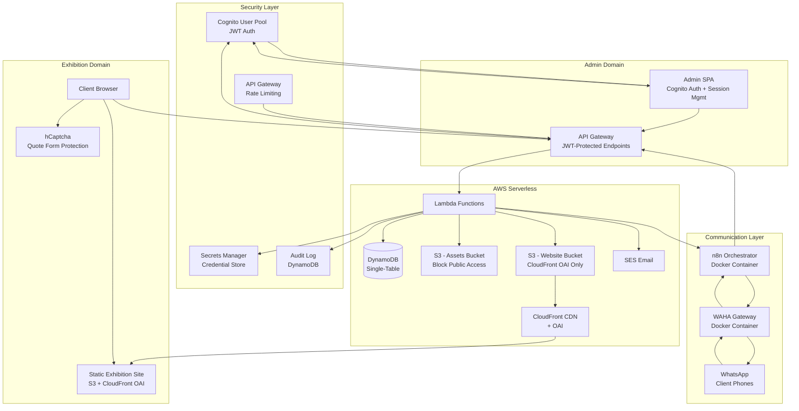
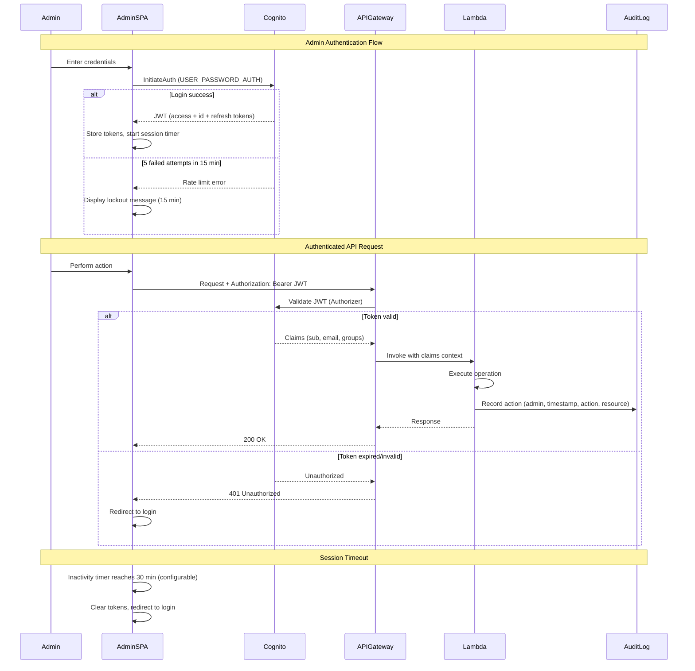
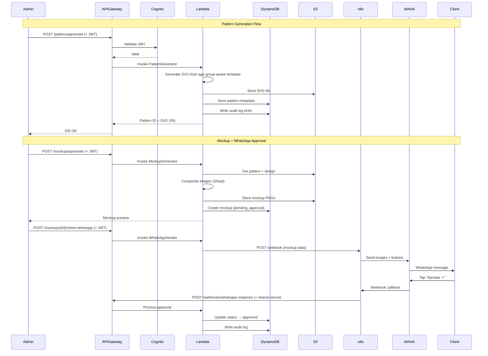
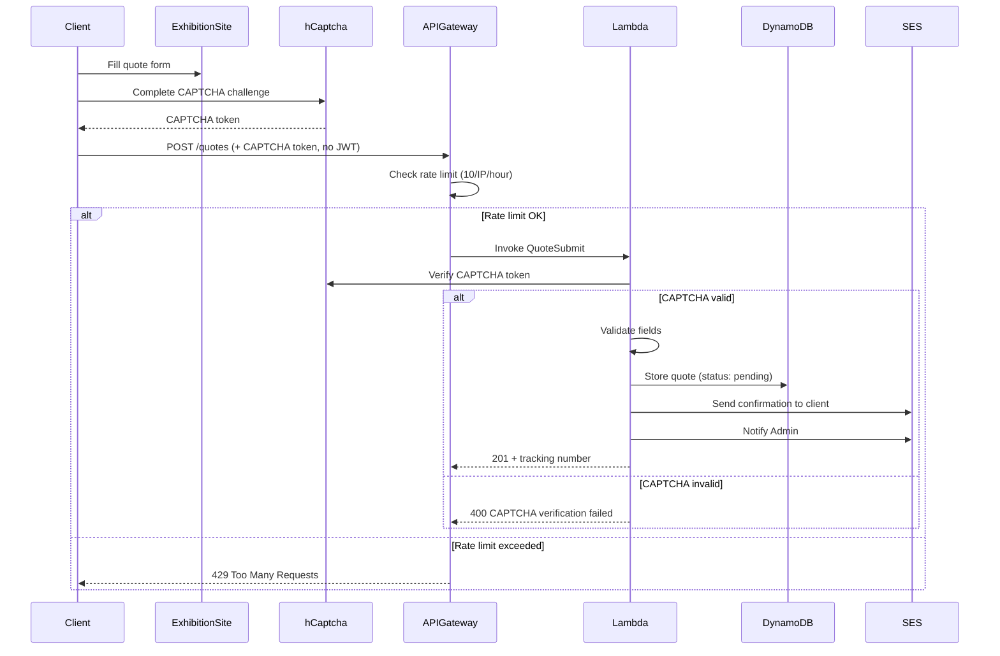

# Design Document: Cronus Fit Catalog Automation

## Overview

Cronus Fit Catalog Automation is a serverless platform that automates the end-to-end sportswear catalog lifecycle — from parametric cutting pattern generation through mockup creation, approval workflows, print-ready file generation, web exhibition, quote management, and social media content generation. The system integrates bidirectional WhatsApp communication via WAHA + n8n for client interaction, all running within AWS Free Tier constraints (zero budget). The platform supports both children's sizes (2T–16) and extended adult sizes (XS–6XL) with age-group-aware parametric templates that adjust for anatomical proportions.

### Key Design Goals

- **Zero-cost infrastructure**: All AWS services operate within Free Tier limits
- **Full automation**: Minimize manual steps from design to publication
- **Bidirectional communication**: WhatsApp-first client interaction via WAHA/n8n
- **Production-ready outputs**: Generate DTF and sublimation print files at professional quality
- **Age-group-aware sizing**: Support children (2T–16) and adults (XS–6XL) with proportionally correct patterns
- **Security-first**: Cognito-based authentication, JWT validation, audit logging, and rate limiting
- **Scalable within constraints**: Efficient resource usage with throttling and monitoring

### Technology Stack

| Layer | Technology |
|-------|-----------|
| Compute | AWS Lambda (Node.js 20.x) |
| Storage | AWS S3 (static hosting + files) |
| Database | AWS DynamoDB (single-table design) |
| API | AWS API Gateway (REST) |
| CDN | AWS CloudFront (with OAI) |
| Auth | AWS Cognito (User Pool + JWT) |
| Secrets | AWS Secrets Manager |
| Email | AWS SES |
| WhatsApp | WAHA (Docker container) |
| Orchestration | n8n (Docker container) |
| Image Processing | Sharp (Lambda Layer) |
| SVG Generation | Custom parametric engine (SVG.js) |
| Static Site | Eleventy (11ty) SSG |
| Frontend | Vanilla JS + Tailwind CSS |
| CAPTCHA | hCaptcha (free tier) |

---

## Architecture

### High-Level Design (HLD)

The system follows an event-driven serverless architecture with four main domains: Admin Platform (secured via Cognito), Exhibition Website (public read-only), Communication Layer (WAHA/n8n), and Security Layer (cross-cutting).



### Low-Level Design (LLD)

#### Authentication and Authorization Flow



#### Request Flow Architecture



#### Quote Submission Flow (Public + CAPTCHA)



#### Static Site Rebuild Pipeline

```mermaid
flowchart LR
    A[Admin publishes product] --> B[Lambda: PublishProduct]
    B --> C[DynamoDB: Mark published]
    C --> D[Lambda: TriggerRebuild]
    D --> E[Lambda: StaticSiteBuilder]
    E --> F[S3: Fetch all published products]
    F --> G[Eleventy: Generate HTML]
    G --> H[S3: Upload to website bucket]
    H --> I[CloudFront: Invalidate cache]
```



### Module Architecture

The system is organized into ten core modules, each implemented as one or more Lambda functions:

| Module | Lambda Functions | Responsibility |
|--------|-----------------|----------------|
| Pattern Generator | `pattern-generate`, `pattern-grade`, `pattern-serialize` | SVG pattern creation, size grading, serialization |
| Mockup Generator | `mockup-generate`, `mockup-composite` | Garment visualization with design overlay |
| Approval Workflow | `approval-process`, `approval-audit` | Status management, audit trail |
| Exhibition Manager | `site-publish`, `site-rebuild`, `site-invalidate` | Static site lifecycle |
| Quote Manager | `quote-submit`, `quote-process`, `quote-notify` | Quote CRUD, notifications |
| Print Generator | `print-dtf`, `print-sublimation` | Production-ready file output |
| Social Generator | `social-generate`, `social-brand` | Instagram/Facebook content |
| WhatsApp Bridge | `wa-send`, `wa-receive`, `wa-queue` | n8n/WAHA integration |
| Monitoring | `monitor-usage`, `monitor-alert` | Free Tier usage tracking |
| Security | `auth-login`, `auth-validate`, `auth-session`, `audit-write` | Authentication, authorization, audit |

---

## Components and Interfaces

### 1. Pattern Generator Module

**Purpose**: Generate parametric SVG cutting patterns from age-group-aware configurable templates.

**Interface**:
```typescript
// POST /api/patterns/generate (JWT required)
interface PatternGenerateRequest {
  garmentType: GarmentType; // camiseta | short | legging | sudadera | tank_top | custom
  ageGroup: AgeGroup; // children | adult
  measurements: Record<string, number>; // control point → mm value
  seamAllowance?: number; // 0.5-3.0 cm, default 1.5
  referenceImageKey?: string; // S3 key for reference image
  customTemplateId?: string; // For custom garment types
}

interface PatternGenerateResponse {
  patternId: string;
  svgUrl: string; // S3 presigned URL
  pieces: PatternPieceMetadata[];
  ageGroup: AgeGroup;
  generatedAt: string; // ISO 8601
}

// Size system with age group discrimination
type AgeGroup = 'children' | 'adult';
type ChildrenSize = '2T' | '4T' | '6' | '8' | '10' | '12' | '14' | '16';
type AdultSize = 'XS' | 'S' | 'M' | 'L' | 'XL' | 'XXL' | '3XL' | '4XL' | '5XL' | '6XL';
type Size = { ageGroup: 'children'; size: ChildrenSize } | { ageGroup: 'adult'; size: AdultSize };

// POST /api/patterns/grade (JWT required)
interface PatternGradeRequest {
  basePatternId: string;
  ageGroup: AgeGroup;
  sizes: ChildrenSize[] | AdultSize[]; // Sizes within the selected age group
  outputFormat: 'separate_files' | 'layered_single';
}

interface PatternGradeResponse {
  gradedPatternIds: Record<string, string>; // size label → pattern ID
  svgUrls: Record<string, string>; // size label → S3 presigned URL
  ageGroup: AgeGroup;
}
```

**Internal Engine** (SVG.js-based):
```typescript
interface ParametricTemplate {
  id: string;
  garmentType: GarmentType;
  ageGroup: AgeGroup; // Determines anatomical proportions used
  controlPoints: ControlPoint[];
  pieceDefinitions: PieceDefinition[];
  defaultMeasurements: Record<string, number>;
  constraints: MeasurementConstraint[];
  proportionProfile: ProportionProfile; // Age-group-specific body proportions
}

// Children vs adult anatomical proportion differences
interface ProportionProfile {
  ageGroup: AgeGroup;
  headToBodyRatio: number; // Children: ~1:5, Adults: ~1:7.5
  limbToTorsoRatio: number; // Children: shorter limbs relative to torso
  waistPositionRatio: number; // Children: higher waist relative to total length
  shoulderToHipRatio: number; // Children: narrower shoulders relative to hips
}

interface ControlPoint {
  id: string;
  name: string;
  x: number; // relative position
  y: number;
  minValue: number; // mm
  maxValue: number; // mm
  affectedPieces: string[];
}

interface GradingIncrementTable {
  garmentType: GarmentType;
  ageGroup: AgeGroup;
  increments: Record<string, Record<string, number>>; // sizeTransition → controlPoint → increment_cm
  // Children: "2T→4T", "4T→6", "6→8", "8→10", "10→12", "12→14", "14→16"
  // Adults: "XS→S", "S→M", "M→L", "L→XL", "XL→XXL", "XXL→3XL", "3XL→4XL", "4XL→5XL", "5XL→6XL"
}

interface PieceDefinition {
  id: string;
  name: string;
  cutQuantity: number;
  pathFunction: string; // parametric path generation formula
  grainLineAngle: number; // degrees
  notchPositions: NotchPosition[];
}
```

### 2. Mockup Generator Module

**Purpose**: Composite garment mockups with design overlays using Sharp.

**Interface**:
```typescript
// POST /api/mockups/generate (JWT required)
interface MockupGenerateRequest {
  patternId: string;
  garmentType: GarmentType;
  designFileKey: string; // S3 key
  placementZone: PlacementZone; // chest | full-front | full-back | left-sleeve | right-sleeve
}

interface MockupGenerateResponse {
  mockupId: string;
  frontImageUrl: string;
  backImageUrl: string;
  status: 'pending_approval';
  scalingApplied?: number; // percentage if design was scaled
}

type PlacementZone = 'chest' | 'full-front' | 'full-back' | 'left-sleeve' | 'right-sleeve';
```

**Processing Pipeline**:
1. Load garment base template (front/back views) from S3
2. Load design graphic from S3
3. Calculate placement area boundaries for the selected zone
4. Scale design if it exceeds zone boundaries (maintain aspect ratio)
5. Composite design onto garment template using Sharp
6. Output 1200×1600 PNG with transparent background
7. Store in S3, create DynamoDB record with `pending_approval` status (atomic)

### 3. Approval Workflow Module

**Interface**:
```typescript
// POST /api/mockups/{id}/approve (JWT required)
interface ApprovalRequest {
  mockupId: string;
  action: 'approve' | 'reject';
  rejectionReason?: string; // 1-500 chars, required for reject
}

// GET /api/mockups?status=pending_approval (JWT required)
interface MockupListResponse {
  mockups: MockupSummary[];
  pagination: { lastKey?: string; count: number };
}

interface AuditTrailEntry {
  entryId: string;
  mockupId: string;
  action: 'approved' | 'rejected' | 'invalid_attempt';
  adminId: string;
  timestamp: string; // UTC ISO 8601
  rejectionReason?: string;
}
```

### 4. Exhibition Website Module

**Purpose**: Static site generation and publication management with CloudFront OAI access.

**Interface**:
```typescript
// POST /api/products/{mockupId}/publish (JWT required)
interface PublishRequest {
  mockupId: string;
  productName: string;
  targetAgeGroups: AgeGroup[]; // Which age groups this product targets
  availableSizes: Size[]; // Sizes from children and/or adult groups
  descriptions: { es: string; en: string };
}

// POST /api/site/rebuild (JWT required)
interface RebuildResponse {
  rebuildId: string;
  status: 'queued' | 'in_progress';
  estimatedCompletion: string;
}
```

**Static Site Structure**:
```
exhibition-site/
├── index.html           # Product grid (responsive 320px-2560px)
├── products/
│   └── {slug}/index.html  # Individual product pages
├── cotizacion/          # Quote request form (+ hCaptcha)
├── estado/              # Quote status lookup (public)
├── assets/
│   ├── css/
│   ├── js/
│   └── images/
├── i18n/
│   ├── es.json          # Default language
│   └── en.json
└── favicon.ico          # Hourglass logo (blue/gold)
```

### 5. Quote Manager Module

**Interface**:
```typescript
// POST /api/quotes (NO JWT — public endpoint, CAPTCHA + rate limit required)
interface QuoteSubmitRequest {
  clientName: string; // 1-100 chars
  email: string; // valid email format
  phone: string; // 7-15 digits with country code
  productId: string;
  quantity: number; // 1-10000
  ageGroup: AgeGroup; // children or adult
  sizes: ChildrenSize[] | AdultSize[]; // Sizes within selected age group
  customizationNotes?: string; // max 1000 chars
  captchaToken: string; // hCaptcha verification token
}

interface QuoteSubmitResponse {
  quoteId: string;
  trackingNumber: string;
  status: 'pending';
}

// GET /api/quotes/{trackingNumber}/status (NO JWT — public endpoint)
interface QuoteStatusResponse {
  trackingNumber: string;
  status: QuoteStatus;
  productName: string;
  submittedAt: string;
}

// POST /api/quotes/{id}/price (JWT required)
interface QuotePriceRequest {
  quoteId: string;
  unitPrice: number;
  totalPrice: number;
  currency: string;
  validUntil: string;
  notes?: string;
}

// GET /api/quotes?status={status} (JWT required)
interface QuoteListResponse {
  quotes: QuoteSummary[];
  pagination: { lastKey?: string; count: number };
}
```

### 6. Print File Generator Module

**Interface**:
```typescript
// POST /api/print/dtf (JWT required)
interface DTFGenerateRequest {
  designId: string;
  widthMm: number; // 10-500mm
  heightMm: number; // 10-500mm
}

interface DTFGenerateResponse {
  mainFileUrl: string; // CMYK PNG at 300+ DPI
  underbaseFileUrl: string; // White layer PNG
  dimensions: { widthMm: number; heightMm: number; dpi: number };
}

// POST /api/print/sublimation (JWT required)
interface SublimationGenerateRequest {
  designId: string;
  widthCm: number; // 1-150cm
  heightCm: number; // 1-150cm
}

interface SublimationGenerateResponse {
  fileUrl: string; // PNG 300 DPI, mirrored, +15% saturation, 3mm bleed
  dimensions: { widthCm: number; heightCm: number; bleedMm: number; dpi: number };
}
```

### 7. WhatsApp Bridge Module

**Interface**:
```typescript
// Internal: Lambda → n8n (credentials from Secrets Manager)
interface WhatsAppSendRequest {
  type: 'mockup' | 'quote';
  recipientPhone: string;
  payload: MockupSharePayload | QuoteSharePayload;
}

interface MockupSharePayload {
  mockupId: string;
  frontImageUrl: string;
  backImageUrl: string;
  productName: string;
  includeButtons: boolean; // true for approval, false for info-only
}

interface QuoteSharePayload {
  quoteId: string;
  productName: string;
  price: string;
  quantity: number;
  ageGroup: AgeGroup;
  sizes: string[]; // Size labels from the selected age group (Children or Adult)
}

// n8n → API Gateway webhook (shared secret authentication)
interface WhatsAppResponseWebhook {
  messageId: string;
  phone: string;
  response: 'approve' | 'reject' | 'accept_quote' | 'reject_quote';
  text?: string; // rejection reason
  timestamp: string;
  token: string; // shared secret for auth (from Secrets Manager)
}

// Delivery log
interface DeliveryLogEntry {
  logId: string;
  messageType: 'mockup' | 'quote';
  recipientPhone: string;
  deliveryTimestamp: string;
  status: 'sent' | 'delivered' | 'read' | 'failed';
  clientResponse?: string;
}
```

### 8. Social Content Generator Module

**Interface**:
```typescript
// Triggered automatically on product publish (internal, JWT context inherited)
interface SocialContentGenerateRequest {
  productId: string;
  mockupFrontUrl: string;
  mockupBackUrl: string;
  productName: string;
}

interface SocialContentGenerateResponse {
  contentId: string;
  instagramImageUrl: string; // 1080x1080 PNG
  facebookImageUrl: string; // 1200x630 PNG
  captionText: string; // Spanish, max 2200 chars, 5-15 hashtags
  status: 'pending_review';
}
```

### 9. Monitoring Module

**Interface**:
```typescript
// Scheduled every 6 hours via EventBridge
interface UsageMetrics {
  service: string;
  currentUsage: number;
  freeLimit: number;
  percentUsed: number;
  period: string; // YYYY-MM
}

interface AlertPayload {
  service: string;
  percentUsed: number;
  threshold: number; // 80 or 100
  action: 'alert' | 'disable_non_essential';
}
```

### 10. Security Module

**Purpose**: Authenticate Admin users, validate JWT tokens, manage sessions, enforce rate limits, log audit trails, and protect credentials.

**Interface**:
```typescript
// Cognito User Pool Configuration
interface CognitoConfig {
  userPoolId: string;
  clientId: string;
  tokenExpiration: {
    accessToken: number; // minutes (default 60)
    idToken: number; // minutes (default 60)
    refreshToken: number; // days (default 30)
  };
  passwordPolicy: {
    minLength: number; // 8
    requireUppercase: boolean; // true
    requireLowercase: boolean; // true
    requireNumbers: boolean; // true
    requireSymbols: boolean; // true
  };
}

// Session Management
interface SessionConfig {
  inactivityTimeoutMinutes: number; // default 30, configurable 5-120
  maxConcurrentSessions: number; // 1 per Admin
}

// Login Rate Limiting
interface LoginRateLimitConfig {
  maxAttempts: number; // 5
  windowMinutes: number; // 15
  lockoutMinutes: number; // 15
}

interface LoginAttemptRecord {
  PK: string; // LOGINATTEMPT#{ipAddress}
  SK: string; // ATTEMPT#{timestamp}
  ipAddress: string;
  timestamp: string; // UTC ISO 8601
  success: boolean;
  adminEmail?: string;
}

// Audit Log
interface AuditLogEntry {
  PK: string; // AUDIT#{adminId}
  SK: string; // ACTION#{timestamp}
  GSI1PK: string; // AUDITTYPE#{actionType}
  GSI1SK: string; // TIME#{timestamp}
  adminId: string;
  adminEmail: string;
  timestamp: string; // UTC ISO 8601
  actionType: string; // pattern_generate, mockup_approve, publish, quote_price, etc.
  resourceId: string;
  resourceType: string;
  metadata?: Record<string, any>;
}

// API Gateway Authorizer (Lambda Authorizer)
interface AuthorizerResponse {
  principalId: string; // Cognito sub
  policyDocument: {
    Version: string;
    Statement: PolicyStatement[];
  };
  context: {
    adminId: string;
    adminEmail: string;
    sessionExpiry: string;
  };
}

// CAPTCHA Verification
interface CaptchaVerifyRequest {
  token: string;
  remoteIp: string;
}

interface CaptchaVerifyResponse {
  success: boolean;
  challengeTs?: string;
  hostname?: string;
  errorCodes?: string[];
}

// Credential Management
interface CredentialConfig {
  wahaApiKey: string; // Stored in Secrets Manager
  wahaWebhookSecret: string; // Stored in Secrets Manager
  n8nWebhookUrl: string; // Stored in Secrets Manager
  hcaptchaSecret: string; // Stored in Secrets Manager
  // Supports rotation without redeployment via Lambda environment refresh
}
```

**Security Architecture Decisions**:

1. **Cognito as Identity Provider**: Leverages AWS Free Tier (50,000 MAU), eliminates custom auth code, provides built-in MFA support path.
2. **API Gateway Lambda Authorizer**: Validates JWT on every request before Lambda invocation — zero compute cost for invalid tokens.
3. **Client-side session timeout**: SPA tracks last interaction; on timeout, clears tokens and redirects to login. Server-side token expiration provides defense-in-depth.
4. **IP-based login rate limiting**: Tracked in DynamoDB with TTL for automatic cleanup. 5 failures / 15 min → 15 min lockout.
5. **hCaptcha for public forms**: Free tier, privacy-respecting, prevents bot spam on quote submissions.
6. **S3 OAI access**: Website bucket is fully private; only CloudFront can read via Origin Access Identity. All other buckets have Block Public Access enabled.
7. **Secrets Manager for credentials**: WAHA API key, n8n webhook URL, hCaptcha secret stored in Secrets Manager. Lambda reads at cold start and caches for warm invocations. Rotation supported without redeployment.
8. **Immutable audit log**: DynamoDB write-only pattern (no updates/deletes on audit entries). Audit writes are best-effort with retry queue — they don't block the primary operation (per Requirement 13.5).

---

## Data Models

### DynamoDB Single-Table Design

The platform uses a single DynamoDB table with a composite key strategy to support all access patterns within Free Tier limits.

**Table**: `CronusFit`
**Key Schema**: `PK` (Partition Key, String), `SK` (Sort Key, String)
**GSI-1**: `GSI1PK`, `GSI1SK` (for status-based queries)
**GSI-2**: `GSI2PK`, `GSI2SK` (for audit and security queries)

```
| Entity              | PK                          | SK                      | GSI1PK               | GSI1SK                  | GSI2PK              | GSI2SK                |
|---------------------|-----------------------------|-----------------------  |----------------------|-------------------------|----------------------|-----------------------|
| Pattern             | PATTERN#{id}                | METADATA                | GARMENT#{type}       | CREATED#{timestamp}     | —                    | —                     |
| Pattern Piece       | PATTERN#{id}                | PIECE#{pieceId}         | —                    | —                       | —                    | —                     |
| Increment Table     | GRADE#{garmentType}#{ageGroup} | SIZE#{sizeTransition}| AGEGROUP#{ageGroup}  | GARMENT#{garmentType}   | —                    | —                     |
| Mockup              | MOCKUP#{id}                 | METADATA                | STATUS#{status}      | CREATED#{timestamp}     | —                    | —                     |
| Approval Audit      | MOCKUP#{id}                 | AUDIT#{timestamp}       | ADMIN#{adminId}      | ACTION#{timestamp}      | —                    | —                     |
| Product             | PRODUCT#{id}                | METADATA                | PUBLISHED#{flag}     | CREATED#{timestamp}     | —                    | —                     |
| Quote               | QUOTE#{id}                  | METADATA                | QSTATUS#{status}     | CREATED#{timestamp}     | —                    | —                     |
| Quote (by track#)   | TRACK#{number}              | QUOTE                   | —                    | —                       | —                    | —                     |
| Social Content      | SOCIAL#{id}                 | METADATA                | STATUS#{status}      | CREATED#{timestamp}     | —                    | —                     |
| WA Delivery Log     | WALOG#{phone}               | MSG#{timestamp}         | DELIVERY#{status}    | SENT#{timestamp}        | —                    | —                     |
| WA Message Queue    | WAQUEUE                     | MSG#{timestamp}#{id}    | —                    | —                       | —                    | —                     |
| Usage Metrics       | USAGE#{service}             | PERIOD#{YYYY-MM}        | —                    | —                       | —                    | —                     |
| Template            | TEMPLATE#{type}#{ageGroup}  | VERSION#{version}       | AGEGROUP#{ageGroup}  | GARMENT#{type}          | —                    | —                     |
| Audit Log           | AUDIT#{adminId}             | ACTION#{timestamp}      | AUDITTYPE#{action}   | TIME#{timestamp}        | RESOURCE#{type}      | RESID#{resourceId}    |
| Login Attempt       | LOGINATTEMPT#{ip}           | ATTEMPT#{timestamp}     | —                    | —                       | —                    | —                     |
| Rebuild Queue       | REBUILD                     | QUEUED#{timestamp}      | —                    | —                       | —                    | —                     |
```

### Key Data Structures

```typescript
// Pattern Entity
interface PatternRecord {
  PK: string; // PATTERN#{uuid}
  SK: 'METADATA';
  GSI1PK: string; // GARMENT#{type}
  GSI1SK: string; // CREATED#{iso-timestamp}
  id: string;
  garmentType: GarmentType;
  ageGroup: AgeGroup; // children | adult
  measurements: Record<string, number>;
  seamAllowanceCm: number;
  svgS3Key: string;
  pieceCount: number;
  createdAt: string;
  createdBy: string; // Admin Cognito sub
  referenceImageS3Key?: string;
}

// Mockup Entity
interface MockupRecord {
  PK: string; // MOCKUP#{uuid}
  SK: 'METADATA';
  GSI1PK: string; // STATUS#pending_approval | STATUS#approved | STATUS#rejected
  GSI1SK: string; // CREATED#{iso-timestamp}
  id: string;
  patternId: string;
  garmentType: GarmentType;
  designS3Key: string;
  frontImageS3Key: string;
  backImageS3Key: string;
  placementZone: PlacementZone;
  scalingPercentage?: number;
  status: 'pending_approval' | 'approved' | 'rejected';
  approvalTimestamp?: string;
  rejectionReason?: string;
  publishedAt?: string;
  publishStatus: 'unpublished' | 'published';
  createdBy: string; // Admin Cognito sub
}

// Quote Entity
interface QuoteRecord {
  PK: string; // QUOTE#{uuid}
  SK: 'METADATA';
  GSI1PK: string; // QSTATUS#pending | QSTATUS#quoted | QSTATUS#accepted | QSTATUS#rejected
  GSI1SK: string; // CREATED#{iso-timestamp}
  id: string;
  trackingNumber: string;
  clientName: string;
  email: string;
  phone: string;
  productId: string;
  quantity: number;
  ageGroup: AgeGroup; // children | adult
  sizes: ChildrenSize[] | AdultSize[]; // Sizes within the selected age group
  customizationNotes?: string;
  status: QuoteStatus;
  unitPrice?: number;
  totalPrice?: number;
  currency?: string;
  validUntil?: string;
  quoteLinkToken?: string; // unique token for quote response link
  createdAt: string;
  updatedAt: string;
}

// Delivery Log Entity
interface DeliveryLogRecord {
  PK: string; // WALOG#{phone}
  SK: string; // MSG#{iso-timestamp}
  GSI1PK: string; // DELIVERY#{status}
  GSI1SK: string; // SENT#{iso-timestamp}
  messageType: 'mockup' | 'quote';
  recipientPhone: string;
  deliveryTimestamp: string;
  status: 'sent' | 'delivered' | 'read' | 'failed';
  clientResponse?: string;
  relatedEntityId: string; // mockupId or quoteId
}
```

### S3 Bucket Structure

```
cronusfit-assets/ (Block Public Access: ENABLED)
├── patterns/
│   └── {patternId}/
│       ├── pattern.svg
│       ├── metadata.json
│       └── graded/
│           ├── children/
│           │   └── {size}.svg    (2T, 4T, 6, 8, 10, 12, 14, 16)
│           └── adult/
│               └── {size}.svg    (XS, S, M, L, XL, XXL, 3XL, 4XL, 5XL, 6XL)
├── designs/
│   └── {designId}.{ext}
├── mockups/
│   └── {mockupId}/
│       ├── front.png
│       └── back.png
├── print-files/
│   └── {jobId}/
│       ├── dtf-main.png
│       ├── dtf-underbase.png
│       └── sublimation.png
├── social/
│   └── {contentId}/
│       ├── instagram.png
│       ├── facebook.png
│       └── caption.txt
├── templates/
│   ├── garment-bases/
│   │   └── {type}_{view}.png
│   └── parametric/
│       ├── adult/
│       │   └── {type}.json       (5 standard garment types)
│       └── children/
│           └── {type}.json       (5 standard garment types)
└── reference-images/
    └── {imageId}.{ext}

cronusfit-website/ (Block Public Access: ENABLED, CloudFront OAI access only)
├── index.html
├── products/
├── cotizacion/
├── estado/
├── assets/
└── i18n/
```

### S3 Bucket Policies

```json
// cronusfit-website bucket policy — OAI access only
{
  "Version": "2012-10-17",
  "Statement": [
    {
      "Sid": "AllowCloudFrontOAI",
      "Effect": "Allow",
      "Principal": {
        "AWS": "arn:aws:iam::cloudfront:user/CloudFront Origin Access Identity {OAI_ID}"
      },
      "Action": "s3:GetObject",
      "Resource": "arn:aws:s3:::cronusfit-website/*"
    }
  ]
}
```

---

## Correctness Properties

*A property is a characteristic or behavior that should hold true across all valid executions of a system — essentially, a formal statement about what the system should do. Properties serve as the bridge between human-readable specifications and machine-verifiable correctness guarantees.*

### Property 1: Pattern Structural Completeness

*For any* valid garment type, valid Age_Group, and valid set of measurements with any seam allowance in [0.5, 3.0] cm, the generated SVG_Pattern SHALL contain: (a) each pattern piece as a separate `<g>` element with a unique identifier, (b) seam allowance paths at the specified width on all pieces, (c) a grain line indicator on each piece, (d) alignment notches at joining edges between pattern pieces, (e) labels with name, size, and cut quantity on each piece, and (f) millimeters as the coordinate unit.

**Validates: Requirements 1.3, 1.4, 1.5, 1.6, 1.10**

### Property 2: Measurement Validation Completeness

*For any* set of measurements where at least one value is missing or outside the valid range [1cm, 200cm], the Pattern_Generator validation function SHALL reject the entire set, return specific error messages identifying every invalid field and its acceptable range, and produce no SVG output.

**Validates: Requirements 1.11**

### Property 3: Custom Template Control Point Validation

*For any* custom template definition with N control points and an Age_Group specification, the Pattern_Generator SHALL accept the template if and only if N >= 4 and a valid Age_Group is provided, rejecting all definitions with fewer than 4 control points.

**Validates: Requirements 1.9**

### Property 4: File Upload Validation

*For any* uploaded file with a given MIME type and file size, the system SHALL accept the file if and only if the format is in the accepted set (JPEG, PNG for reference images; JPEG, PNG, SVG for design files) and the size is at most 10MB, rejecting all other combinations with a specific error message indicating accepted formats and maximum size.

**Validates: Requirements 1.2, 4.6**

### Property 5: Age-Group Template Availability

*For any* standard Garment_Type (camiseta, short, legging, sudadera, tank top), there SHALL exist both a children's Parametric_Template and an adult Parametric_Template, each with a ProportionProfile reflecting the correct anatomical proportions for that Age_Group.

**Validates: Requirements 1.8**

### Property 6: Grading Proportionality and Structural Preservation

*For any* base SVG_Pattern, valid Age_Group, and corresponding age-group-specific Grading_Increment_Table, when grading is applied to produce sizes in the selected group (Children_Size: [2T, 4T, 6, 8, 10, 12, 14, 16] or Adult_Size: [XS, S, M, L, XL, XXL, 3XL, 4XL, 5XL, 6XL]), each graded pattern SHALL: (a) for Adult_Size — have dimensions scaled according to the adult increment table values maintaining relative proportions between width and length; (b) for Children_Size — have dimensions adjusted using the children's increment table with proportional corrections for children's anatomy (larger head-to-body ratio, shorter limbs relative to torso, higher waist position, narrower shoulders relative to hips) rather than linearly scaling adult patterns; (c) maintain the same count of notches, grain lines, and labels as the base pattern; and (d) position metadata elements at the same relative proportional locations as the original.

**Validates: Requirements 2.1, 2.2, 2.3, 2.4, 2.5**

### Property 7: Grading Increment Table Validation

*For any* Grading_Increment_Table configuration, the validation function SHALL accept the table if and only if: all increment values are positive numbers between 0.1cm and 10cm per size step, and the table contains entries for all consecutive size transitions within the selected Age_Group (Children: 2T→4T, 4T→6, 6→8, 8→10, 10→12, 12→14, 14→16; Adults: XS→S, S→M, M→L, L→XL, XL→XXL, XXL→3XL, 3XL→4XL, 4XL→5XL, 5XL→6XL).

**Validates: Requirements 2.8**

### Property 8: Serialization Round-Trip Idempotence

*For any* valid SVG_Pattern, serializing it to JSON, deserializing the JSON back to an SVG_Pattern, and re-serializing to JSON SHALL produce: (a) a JSON representation with identical keys, values, and structure (byte-equivalent after key-order normalization), (b) all pattern piece geometries matching the original within 0.01mm tolerance, (c) the deserialized SVG passing SVG 1.1 schema validation, and (d) the serialized JSON not exceeding 400KB in size.

**Validates: Requirements 3.1, 3.2, 3.3, 3.4**

### Property 9: Malformed JSON Rejection

*For any* JSON input that is malformed or contains missing required fields, the deserialization function SHALL reject the input entirely without producing a partial SVG_Pattern and SHALL return an error specifying which fields are invalid or missing.

**Validates: Requirements 3.5**

### Property 10: Mockup Output Specification

*For any* valid mockup generation request (valid pattern + valid design file + valid placement zone), the Mockup_Generator SHALL produce exactly two PNG images (front and back views) at minimum 1200×1600 pixels with transparent background, with the design composited within the bounds of the selected placement zone.

**Validates: Requirements 4.1, 4.2, 4.3**

### Property 11: Design Scaling Correctness

*For any* design graphic and placement zone, if the design dimensions exceed the zone boundaries, the Mockup_Generator SHALL scale the design proportionally (maintaining aspect ratio) to fit within the zone and report the scaling percentage; if the design fits within the zone, no scaling SHALL be applied and no notification SHALL be sent.

**Validates: Requirements 4.7**

### Property 12: Approval State Machine Integrity

*For any* mockup, the Approval_Workflow SHALL enforce: (a) only mockups with status "pending_approval" can be approved or rejected, (b) approval transitions status to "approved" with timestamp recorded, (c) rejection requires a reason of 1-500 characters and transitions status to "rejected" with reason stored, (d) only mockups with status "approved" can be published, and (e) all actions (valid and invalid attempts) are recorded in the audit trail with action type, mockup ID, admin identity, and timestamp.

**Validates: Requirements 5.2, 5.3, 5.4, 5.6, 5.7**

### Property 13: Approval Queue Ordering

*For any* set of mockups with status "pending_approval", the review queue SHALL return them ordered by generation date from oldest to newest.

**Validates: Requirements 5.5**

### Property 14: Publication Filter Invariant

*For any* set of products in the system, the Exhibition_Website output SHALL contain exactly and only those products whose publish status is "published" — no unpublished, merely approved, or non-approved products SHALL appear. Additionally, only mockups with status "approved" can be marked as published.

**Validates: Requirements 6.1, 6.4, 6.5**

### Property 15: Product Page Content Completeness

*For any* published product, the rendered exhibition page SHALL contain: front mockup image, back mockup image, product name, target Age_Group (children and/or adult), and available sizes (from Children_Size: 2T, 4T, 6, 8, 10, 12, 14, 16 and/or Adult_Size: XS, S, M, L, XL, XXL, 3XL, 4XL, 5XL, 6XL as applicable), in both Spanish and English language versions.

**Validates: Requirements 6.9, 6.10**

### Property 16: Quote Request Validation

*For any* quote request submission, the validation function SHALL accept the request if and only if: client name is 1-100 characters, email matches valid email format, phone is 7-15 digits with country code, quantity is a positive integer in [1, 10000], a valid Age_Group is selected (children or adult), at least one size is selected from the corresponding age group's valid sizes (Children_Size: 2T, 4T, 6, 8, 10, 12, 14, 16 or Adult_Size: XS, S, M, L, XL, XXL, 3XL, 4XL, 5XL, 6XL), and customization notes (if provided) are at most 1000 characters. Invalid submissions SHALL return field-level error messages for every invalid field.

**Validates: Requirements 7.2, 7.3, 7.6**

### Property 17: Quote Status Filtering

*For any* Quote_Status filter value and any set of quotes in the database, the filtered query SHALL return exactly those quotes whose status matches the filter, with no false inclusions or exclusions.

**Validates: Requirements 7.10**

### Property 18: Quote Tracking Number Uniqueness

*For any* two distinct quote submissions, the system SHALL assign different tracking numbers, and looking up any tracking number SHALL return the correct and complete quote data.

**Validates: Requirements 7.11**

### Property 19: DTF Output Specification

*For any* approved design and valid print dimensions (10-500mm per side), the DTF generator SHALL produce: (a) a main PNG file at minimum 300 DPI with transparent background in CMYK color space, (b) a separate white ink underbase PNG at the same DPI and dimensions, and (c) output dimensions matching the specified millimeter values exactly.

**Validates: Requirements 8.1, 8.2, 8.3, 8.4, 8.5**

### Property 20: Sublimation Output Specification

*For any* approved design and valid print dimensions (1-150cm per side), the sublimation generator SHALL produce a PNG file at 300 DPI with: (a) 3mm bleed added on all edges beyond the specified dimensions, (b) the image horizontally mirrored, and (c) color saturation increased by 15% relative to the source.

**Validates: Requirements 9.1, 9.2, 9.3, 9.4, 9.5**

### Property 21: Social Content Format Specification

*For any* published product with valid mockup images, the Social_Content_Generator SHALL produce: (a) an Instagram image of exactly 1080×1080 pixels at 72 DPI in PNG format with brand overlay, (b) a Facebook image of exactly 1200×630 pixels at 72 DPI in PNG format with brand overlay, and (c) a Spanish caption text of at most 2200 characters containing between 5 and 15 hashtags.

**Validates: Requirements 10.1, 10.2, 10.3, 10.6**

### Property 22: Free Tier Threshold Alerting

*For any* AWS service usage level, the monitoring system SHALL trigger an alert if and only if usage exceeds 80% of the monthly Free Tier limit, and SHALL disable non-essential operations (social content generation, new mockup generation) while maintaining read-only access to the Exhibition_Website if and only if usage reaches 100%.

**Validates: Requirements 11.8, 11.10**

### Property 23: WhatsApp Message Button Logic

*For any* mockup share request, the WhatsApp message SHALL include interactive reply buttons ("Aprobar ✓" / "Rechazar ✗") if and only if the share is for approval purposes; informational shares SHALL never include interactive buttons.

**Validates: Requirements 12.3**

### Property 24: WhatsApp Quote Message Completeness

*For any* quote with status "quoted" that is shared via WhatsApp, the message SHALL contain: product name, quoted price, quantity, Age_Group, available sizes (from Children_Size or Adult_Size as applicable), and interactive buttons "Aceptar Cotización" and "Rechazar Cotización".

**Validates: Requirements 12.6**

### Property 25: WhatsApp Webhook Authentication

*For any* incoming webhook payload, the WhatsApp Bridge SHALL accept the payload if and only if it contains a valid shared secret token matching the stored secret, rejecting all payloads with missing or invalid tokens.

**Validates: Requirements 12.9**

### Property 26: WhatsApp Retry with Exponential Backoff

*For any* failed WhatsApp message delivery attempt, the system SHALL retry exactly 3 times with delays of 30s, 60s, and 120s respectively, and if all retries fail, SHALL queue the message, notify the Admin, and fall back to email-only delivery.

**Validates: Requirements 12.10**

### Property 27: WhatsApp Delivery Log Completeness

*For any* WhatsApp message sent through the system, a delivery log entry SHALL be created containing: message type (mockup/quote), recipient phone number, delivery timestamp, delivery status (sent/delivered/read/failed), and client response if applicable.

**Validates: Requirements 12.11**

### Property 28: JWT Authentication Enforcement

*For any* request to a protected API endpoint (all endpoints except Exhibition_Website read-only and quote submission/status lookup), the system SHALL reject the request with HTTP 401 if the JWT_Token is missing, expired, or invalid, and SHALL NOT execute the requested operation.

**Validates: Requirements 13.1, 13.2**

### Property 29: Session Inactivity Timeout

*For any* Admin_Session with a configured inactivity timeout T (where T is between 5 and 120 minutes, default 30), the system SHALL invalidate the session and require re-authentication when the time elapsed since the last Admin interaction exceeds T minutes.

**Validates: Requirements 13.3**

### Property 30: Login Rate Limiting

*For any* IP address, if 5 or more failed login attempts occur within a 15-minute window, the system SHALL block further login attempts from that IP for 15 minutes and log the lockout event. Fewer than 5 failures within the window SHALL NOT trigger a lockout.

**Validates: Requirements 13.4**

### Property 31: Audit Log Completeness

*For any* Admin action performed on the Platform, the Audit_Log SHALL record: Admin identity (Cognito sub), timestamp (UTC ISO 8601 format), action type, and affected resource identifier within 5 seconds of action completion. If audit recording fails, the primary action SHALL still complete but the audit entry SHALL be queued for retry.

**Validates: Requirements 13.5**

### Property 32: Quote Submission CAPTCHA and Rate Limiting

*For any* quote submission via the public form, the system SHALL require successful CAPTCHA verification before processing. Additionally, *for any* IP address, the system SHALL enforce a maximum of 10 quote submissions per hour; submissions exceeding this limit SHALL be rejected with an appropriate error message.

**Validates: Requirements 13.7**

---

## Error Handling

### Error Categories and Strategies

| Category | Strategy | User Impact |
|----------|----------|-------------|
| Authentication Errors | Immediate 401 rejection, no operation executed | Admin redirected to login |
| Authorization Errors | 403 rejection, audit log entry | Admin sees permission error |
| Rate Limit Errors | 429 rejection with retry-after header | Client/IP sees cooldown message |
| Validation Errors | Immediate rejection with field-level messages | Client/Admin sees specific errors |
| Processing Errors | Graceful failure, preserve input, notify Admin | Admin can retry with same data |
| Storage Errors | Atomic rollback, no partial state | System remains consistent |
| External Service Errors | Retry with exponential backoff, fallback | Delayed but eventual delivery |
| Resource Limit Errors | Graceful degradation, alert Admin | Non-essential features disabled |
| Audit Log Errors | Best-effort with retry queue, don't block primary operation | Action completes, log delayed |

### Authentication and Security Error Handling

```typescript
// JWT validation errors
interface AuthError {
  statusCode: 401 | 403;
  error: 'Unauthorized' | 'Forbidden';
  message: string; // e.g., "Token expired", "Invalid token signature"
}

// Rate limit errors
interface RateLimitError {
  statusCode: 429;
  error: 'Too Many Requests';
  message: string;
  retryAfter: number; // seconds until retry allowed
}

// Login lockout
interface LoginLockoutResponse {
  statusCode: 429;
  error: 'Account Locked';
  message: string; // "Too many failed attempts. Try again in X minutes."
  lockedUntil: string; // ISO 8601 timestamp
}
```

### Validation Error Handling

```typescript
interface ValidationError {
  field: string;
  value: any;
  constraint: string;
  message: string; // Human-readable, bilingual (es/en)
}

interface ValidationResult {
  valid: boolean;
  errors: ValidationError[];
}
```

- Pattern measurements: reject if any value outside [1cm, 200cm], report all invalid fields
- File uploads: reject if format not JPEG/PNG/SVG or size > 10MB
- Quote requests: validate all fields, return field-level errors for each invalid field
- Print dimensions: reject if outside allowed range (DTF: 10-500mm, Sublimation: 1-150cm)
- Rejection reasons: reject if < 1 or > 500 characters
- Increment table values: reject if any value outside [0.1cm, 10cm]
- Session timeout config: reject if outside [5, 120] minutes

### Processing Error Handling

- **Pattern generation failures**: Preserve all entered measurements, display error cause, allow immediate retry
- **Mockup generation failures**: No mockup record created (atomic), Admin notified, original assets preserved
- **Print file generation failures**: No download URL generated, original design unchanged, specific error displayed
- **Social content failures**: No queue entry created, failure logged, Admin notified, manual retry available
- **Static site rebuild failures**: Previous site version remains live, rebuild queued for retry
- **Grading failures**: No partial output produced, all partial files cleaned up, specific failure reason displayed

### External Service Error Handling

```typescript
// Retry configuration
interface RetryConfig {
  maxRetries: number;
  backoffMs: number[];
  fallback: 'email' | 'queue' | 'none';
}

// SES email delivery
const sesRetryConfig: RetryConfig = {
  maxRetries: 3,
  backoffMs: [5000, 15000, 45000],
  fallback: 'queue' // store and deliver when service recovers
};

// WhatsApp (WAHA/n8n)
const wahaRetryConfig: RetryConfig = {
  maxRetries: 3,
  backoffMs: [30000, 60000, 120000],
  fallback: 'email' // fall back to email-only delivery
};

// Audit log retry
const auditRetryConfig: RetryConfig = {
  maxRetries: 5,
  backoffMs: [1000, 2000, 4000, 8000, 16000],
  fallback: 'queue' // queue for later processing
};

// CAPTCHA verification
const captchaRetryConfig: RetryConfig = {
  maxRetries: 2,
  backoffMs: [1000, 3000],
  fallback: 'none' // reject submission if CAPTCHA service unavailable
};
```

### Atomic Operations

Operations that must be atomic (all-or-nothing):
1. **Mockup creation**: Image storage + DynamoDB record must both succeed or both fail
2. **Quote status transitions**: Status update + notification must both succeed (with retry for notification)
3. **Approval/Rejection**: Status update + audit trail entry must both succeed (audit retried if fails)
4. **Social content storage**: All three content types must generate before storing any
5. **Login lockout**: Attempt count increment + lockout record must be consistent

Implementation: DynamoDB conditional writes with `TransactWriteItems` for multi-item atomicity.

### Graceful Degradation (Free Tier Limits)

When any service reaches 100% Free Tier:
1. **Disable**: Social content generation, new mockup generation, new pattern generation
2. **Maintain**: Exhibition website (read-only via CloudFront cache), existing data access, quote status lookups, authentication (Cognito operates independently)
3. **Alert**: Admin notification within 10 minutes of detection
4. **Confirm**: Non-essential operations are confirmed disabled before maintaining read-only mode

---

## Testing Strategy

### Testing Approach

The platform uses a dual testing approach combining unit tests for specific examples/edge cases and property-based tests for universal correctness guarantees.

### Property-Based Testing Configuration

- **Library**: [fast-check](https://github.com/dubzzz/fast-check) (TypeScript/Node.js)
- **Minimum iterations**: 100 per property test
- **Tag format**: `Feature: cronusfit-catalog-automation, Property {number}: {property_text}`

### Test Categories

#### Property-Based Tests (32 properties)

Each correctness property (Properties 1-32) will be implemented as a dedicated property-based test using fast-check with minimum 100 iterations. Key test generators needed:

| Generator | Description |
|-----------|-------------|
| `arbitraryMeasurements()` | Random valid/invalid measurement sets |
| `arbitraryGarmentType()` | Random garment type selection |
| `arbitraryAgeGroup()` | Random age group (children or adult) |
| `arbitraryChildrenSize()` | Random children's size from [2T, 4T, 6, 8, 10, 12, 14, 16] |
| `arbitraryAdultSize()` | Random adult size from [XS, S, M, L, XL, XXL, 3XL, 4XL, 5XL, 6XL] |
| `arbitrarySize(ageGroup)` | Random size within the given age group |
| `arbitrarySeamAllowance()` | Random value in [0.5, 3.0] |
| `arbitraryControlPoints(n)` | Random set of n control points |
| `arbitrarySVGPattern()` | Random valid SVG pattern structure |
| `arbitraryIncrementTable(ageGroup)` | Random grading increment table for the given age group |
| `arbitraryProportionProfile(ageGroup)` | Random proportion profile (children or adult anatomy) |
| `arbitraryQuoteRequest()` | Random quote request with valid/invalid fields including ageGroup and sizes |
| `arbitraryDimensions(min, max)` | Random dimensions within range |
| `arbitraryFileMetadata()` | Random file type + size combinations |
| `arbitraryMockupStatus()` | Random mockup status values |
| `arbitraryUsageLevel()` | Random service usage percentages |
| `arbitraryWebhookPayload()` | Random webhook with valid/invalid tokens |
| `arbitraryJWT()` | Random JWT tokens (valid, expired, malformed, missing) |
| `arbitraryLoginAttempts()` | Random sequences of login attempts per IP |
| `arbitrarySessionConfig()` | Random session timeout configurations [5-120 min] |
| `arbitraryAdminAction()` | Random admin action types with resource IDs |
| `arbitraryIPAddress()` | Random IP addresses for rate limiting tests |
| `arbitraryCaptchaToken()` | Random CAPTCHA tokens (valid/invalid) |

#### Unit Tests (Example-Based)

- Pattern generation error handling (template unavailable, processing errors)
- Mockup atomic storage (success/failure scenarios)
- Grading failure cleanup (no partial output)
- DTF/Sublimation error paths
- Social content partial failure (no queue entry)
- Exhibition site bilingual default behavior (Spanish default, localStorage persistence)
- Quote link acceptance/rejection with notification retry
- Cognito authentication flow (specific token scenarios)
- Public endpoint accessibility without JWT (exhibition, quote status)
- Login lockout event logging
- Credential rotation without redeployment

#### Integration Tests

- Full pattern → mockup → approval → publish pipeline
- Quote submission → Admin pricing → Client response flow
- WhatsApp mockup sharing and approval via WAHA/n8n
- WhatsApp quote notification and response flow
- Static site rebuild triggered by publish/unpublish (with queue)
- SES email delivery for quote confirmations
- CloudFront cache invalidation after rebuild
- Cognito login → JWT → API Gateway authorizer → Lambda flow
- CAPTCHA verification on quote submission
- Rate limiting enforcement on quote submissions

#### Smoke Tests

- All 5 standard parametric templates loaded (children + adult = 10 total)
- WAHA container health check
- n8n webhook endpoint reachable
- S3 website bucket accessible only via CloudFront (direct S3 URL denied)
- S3 assets bucket has Block Public Access enabled
- Cognito User Pool exists and authentication flow works
- SES sending capability verified
- DynamoDB table exists with correct schema + GSIs
- Secrets Manager contains required credentials
- API Gateway throttling configured at 100 req/s

### Test Architecture

```
tests/
├── properties/          # Property-based tests (fast-check)
│   ├── pattern.property.test.ts        # Properties 1-5
│   ├── grading.property.test.ts        # Properties 6-7
│   ├── serialization.property.test.ts  # Properties 8-9
│   ├── mockup.property.test.ts         # Properties 10-11
│   ├── approval.property.test.ts       # Properties 12-13
│   ├── exhibition.property.test.ts     # Properties 14-15
│   ├── quote.property.test.ts          # Properties 16-18
│   ├── print.property.test.ts          # Properties 19-20
│   ├── social.property.test.ts         # Property 21
│   ├── monitoring.property.test.ts     # Property 22
│   ├── whatsapp.property.test.ts       # Properties 23-27
│   └── security.property.test.ts       # Properties 28-32
├── unit/                # Example-based unit tests
│   ├── pattern-generator.test.ts
│   ├── mockup-generator.test.ts
│   ├── approval-workflow.test.ts
│   ├── quote-manager.test.ts
│   ├── print-generator.test.ts
│   ├── social-generator.test.ts
│   ├── security-auth.test.ts
│   └── security-ratelimit.test.ts
├── integration/         # Integration tests
│   ├── pipeline.integration.test.ts
│   ├── whatsapp-flow.integration.test.ts
│   ├── quote-flow.integration.test.ts
│   ├── site-rebuild.integration.test.ts
│   └── auth-flow.integration.test.ts
├── smoke/               # Smoke tests
│   └── infrastructure.smoke.test.ts
└── generators/          # Shared test data generators
    ├── pattern.generators.ts
    ├── mockup.generators.ts
    ├── quote.generators.ts
    ├── security.generators.ts
    └── common.generators.ts
```

### Mocking Strategy

- **S3**: Use `aws-sdk-client-mock` for S3 operations in unit/property tests
- **DynamoDB**: Use `aws-sdk-client-mock` or DynamoDB Local for property tests
- **Sharp**: Mock for fast property tests; real Sharp for integration tests
- **WAHA/n8n**: Mock webhook endpoints in unit tests; real containers in integration
- **SES**: Mock in all non-integration tests
- **CloudFront**: Mock invalidation API in unit tests
- **Cognito**: Mock `aws-sdk-client-mock` for Cognito in unit/property tests; real Cognito in integration
- **Secrets Manager**: Mock in unit tests; use test secrets in integration
- **hCaptcha**: Mock verification endpoint in unit/property tests

### CI/CD Test Pipeline

1. **Pre-commit**: Lint + format (ESLint + Prettier)
2. **Unit + Property tests**: Run on every push (< 3 min)
3. **Integration tests**: Run on PR merge to main (< 5 min, uses DynamoDB Local + mocked WAHA + test Cognito pool)
4. **Smoke tests**: Run post-deployment (< 1 min)
5. **Security scan**: Run on every push (dependency audit + secret detection)
