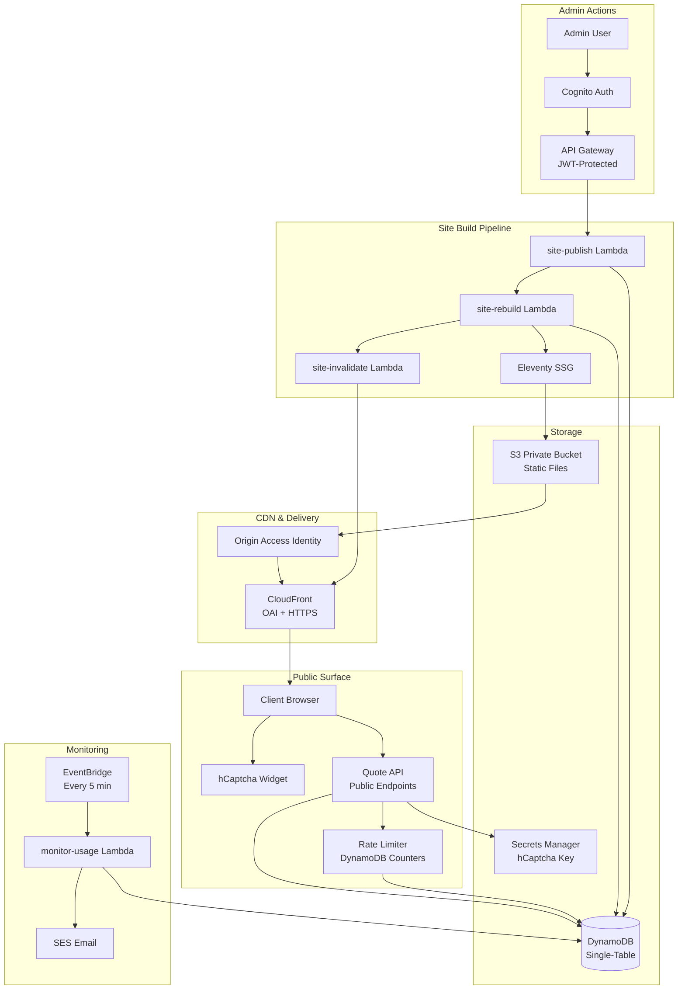
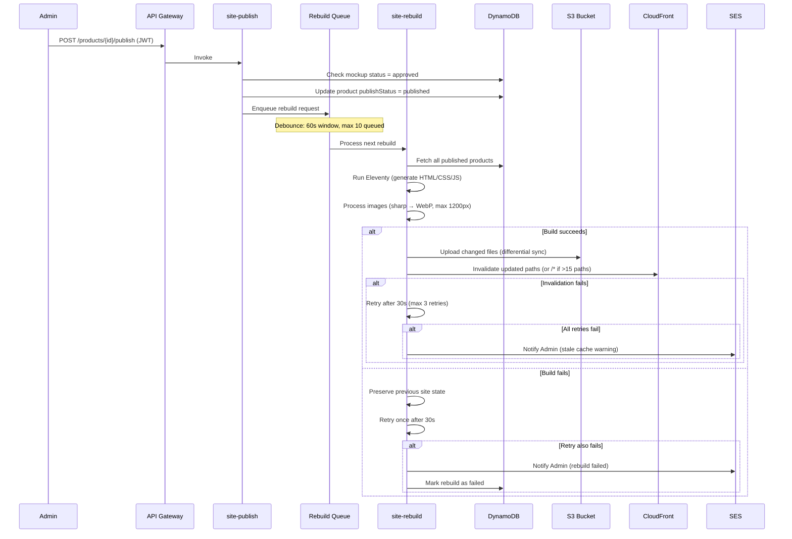
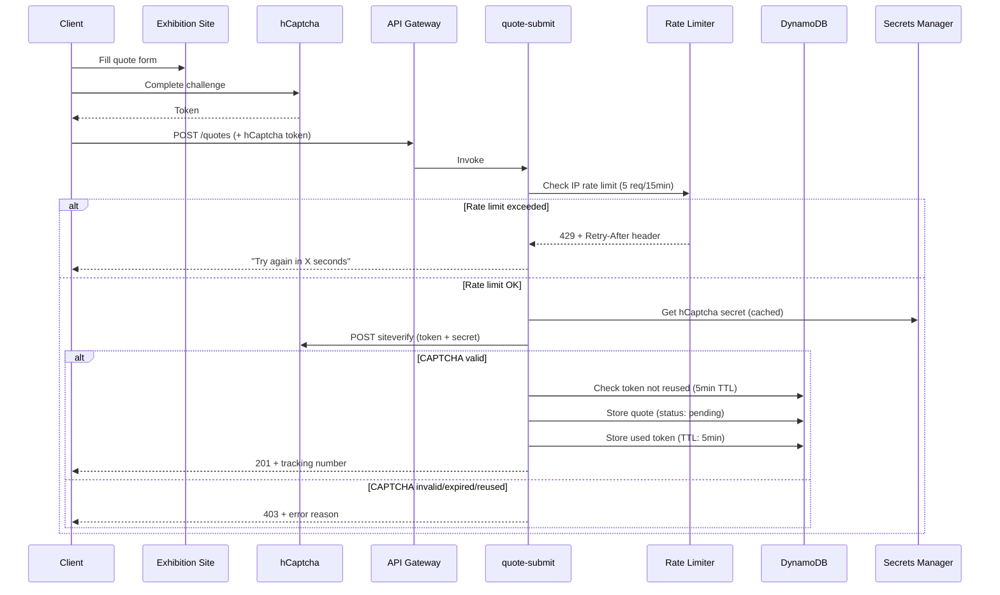
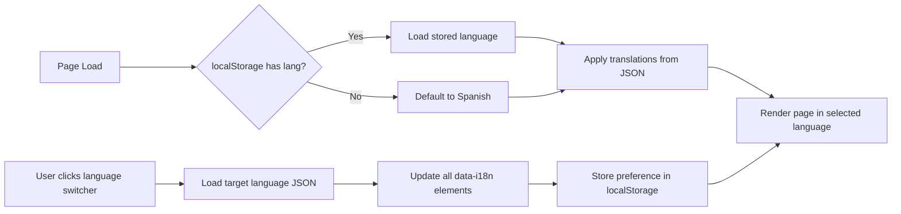

# Design Document: Exhibition Website

## Overview

The Exhibition Website is a statically-generated public site for CronusFit that showcases published sportswear products to external visitors. It operates as an independent bounded context from the catalog automation system — consuming product data from DynamoDB but maintaining its own deployment lifecycle, security surface (public-facing with hCaptcha + rate limiting), and CDN configuration.

The site is built with Eleventy (@11ty/eleventy) and styled with TailwindCSS, hosted on a private S3 bucket accessible exclusively through CloudFront with Origin Access Identity (OAI). It supports bilingual content (Spanish primary, English secondary) via client-side language switching with no URL changes. Public forms (quote request at `/cotizacion/` and status lookup at `/estado/`) are protected by hCaptcha verification and IP-based rate limiting stored in DynamoDB.

### Key Design Goals

- **Performance**: Static HTML generation ensures sub-second page loads via CloudFront CDN
- **Security**: Private S3 bucket (OAI-only access), hCaptcha on all forms, IP rate limiting on public API endpoints
- **Cost-zero**: All infrastructure operates within AWS Free Tier limits with automatic degradation at thresholds
- **Bilingual UX**: Seamless Spanish/English switching without page reloads or URL changes
- **Admin control**: Manual publication workflow — no product goes live without explicit Admin action
- **Resilience**: Failed rebuilds preserve the previous site state; failed cache invalidations retry automatically

### Technology Stack

| Layer | Technology |
|-------|-----------|
| Static Site Generator | @11ty/eleventy |
| Frontend Styling | TailwindCSS (purged, minified) |
| Image Processing | sharp (WebP conversion, resize) |
| Hosting | S3 (private bucket) |
| CDN | CloudFront (OAI, HTTPS, TLS 1.2+) |
| API | API Gateway (REST, public endpoints) |
| Compute | Lambda (Node.js 20.x, TypeScript) |
| Database | DynamoDB (single-table, rate limit counters + token store) |
| CAPTCHA | hCaptcha (server-side verification) |
| Secrets | AWS Secrets Manager (hCaptcha secret key) |
| Email | SES (Admin notifications) |
| Scheduling | EventBridge (usage monitoring every 5 min) |
| Auth (Admin) | Cognito (JWT for publish/unpublish actions) |

---

## Architecture

### High-Level Architecture

The Exhibition Website consists of three main subsystems: the Static Site Builder (generates HTML from product data), the Public API (handles quote submissions and status queries), and the Monitoring System (tracks Free Tier usage).



### Site Rebuild Pipeline



### Public Quote Flow



### Bilingual System (Client-Side)



---

## Components and Interfaces

### 1. Site Builder Module (`src/modules/exhibition/site-builder.ts`)

**Purpose**: Orchestrates Eleventy-based static site generation from published product data.

```typescript
interface SiteBuilderConfig {
  outputDir: string;         // _site output directory
  templateDir: string;       // exhibition-site/ source templates
  imageMaxSize: number;      // 1200px longest side
  imageQuality: number;      // 80% WebP quality
  maxProducts: number;       // Safety limit for build
  buildTimeoutMs: number;    // 60000ms (60s)
}

interface BuildResult {
  success: boolean;
  pagesGenerated: number;
  imagesProcessed: number;
  cssSize: number;           // bytes, minified
  buildDurationMs: number;
  changedPaths: string[];    // Paths that differ from previous build
  errors?: BuildError[];
}

interface BuildError {
  type: 'data_fetch' | 'template_render' | 'image_process' | 'output_write';
  message: string;
  productId?: string;
}

// Core function
async function buildSite(products: PublishedProduct[]): Promise<BuildResult>;
```

### 2. Publish Module (`src/modules/exhibition/publish.ts`)

**Purpose**: Manages product publication state and triggers rebuild pipeline.

```typescript
interface PublishAction {
  productId: string;
  mockupId: string;
  action: 'publish' | 'unpublish';
  adminId: string;
}

interface PublishResult {
  success: boolean;
  rebuildQueued: boolean;
  queuePosition?: number;
  error?: string;
}

// Validates mockup is approved before allowing publish
async function publishProduct(action: PublishAction): Promise<PublishResult>;
async function unpublishProduct(productId: string, adminId: string): Promise<PublishResult>;
```

### 3. Rebuild Queue Module (`src/modules/exhibition/rebuild.ts`)

**Purpose**: Manages sequential rebuild processing with debouncing.

```typescript
interface RebuildRequest {
  rebuildId: string;
  triggeredBy: string;       // Admin ID
  triggeredAt: string;       // ISO 8601
  reason: 'publish' | 'unpublish' | 'manual';
}

interface RebuildQueueConfig {
  maxQueueDepth: number;     // 10
  debounceWindowMs: number;  // 60000ms
  retryDelayMs: number;      // 30000ms
  maxRetries: number;        // 1
}

interface RebuildStatus {
  rebuildId: string;
  status: 'queued' | 'in_progress' | 'completed' | 'failed';
  startedAt?: string;
  completedAt?: string;
  error?: string;
  retryCount: number;
}

async function enqueueRebuild(request: RebuildRequest): Promise<{ queued: boolean; position: number }>;
async function processNextRebuild(): Promise<RebuildStatus>;
```

### 4. Cache Invalidation Module (`src/lambdas/site-invalidate/handler.ts`)

**Purpose**: Invalidates CloudFront cached paths after successful rebuild.

```typescript
interface InvalidationRequest {
  changedPaths: string[];    // Paths that changed in the rebuild
  distributionId: string;
}

interface InvalidationResult {
  success: boolean;
  invalidationId?: string;
  strategy: 'individual' | 'wildcard';  // wildcard if >15 paths
  retriesAttempted: number;
  error?: string;
}

// If >15 paths changed, uses /* wildcard instead of individual paths
async function invalidateCache(request: InvalidationRequest): Promise<InvalidationResult>;
```

### 5. Quote Submit Lambda (`src/lambdas/quote-submit/handler.ts`)

**Purpose**: Processes public quote form submissions with hCaptcha + rate limiting.

```typescript
// POST /quotes (public, no JWT)
interface QuoteSubmitRequest {
  clientName: string;        // 1-100 chars
  email: string;             // RFC 5322 valid
  phone: string;             // E.164 format, 7-15 digits
  productId: string;
  quantity: number;          // 1-10000
  ageGroup: AgeGroup;
  sizes: string[];           // Valid sizes for the selected age group
  customizationNotes?: string; // max 1000 chars
  captchaToken: string;
}

interface QuoteSubmitResponse {
  trackingNumber: string;
  status: 'pending';
  message: string;           // Localized confirmation
}
```

### 6. Quote Status Lambda (`src/lambdas/quote-status/handler.ts`)

**Purpose**: Processes public quote status queries with hCaptcha + rate limiting.

```typescript
// GET /quotes/{trackingNumber}/status (public, no JWT)
// Query params: captchaToken
interface QuoteStatusResponse {
  trackingNumber: string;
  status: QuoteStatus;       // pending | quoted | accepted | rejected
  submittedAt: string;       // ISO 8601, formatted per locale on client
  productName: string;
}
```

### 7. Rate Limiter Module (`src/modules/security/public-rate-limiter.ts`)

**Purpose**: IP-based rate limiting for public API endpoints using DynamoDB counters with TTL.

```typescript
interface RateLimitConfig {
  endpoint: 'quote-submit' | 'quote-status';
  maxRequests: number;       // 5 for submit, 10 for status
  windowSeconds: number;     // 900 (15 minutes)
}

interface RateLimitResult {
  allowed: boolean;
  currentCount: number;
  remainingRequests: number;
  retryAfterSeconds?: number; // Seconds until window expires
}

// Uses leftmost untrusted IP from X-Forwarded-For
async function checkRateLimit(ip: string, config: RateLimitConfig): Promise<RateLimitResult>;
function extractClientIp(xForwardedFor: string | undefined): string | null;
```

### 8. hCaptcha Verification Module (`src/modules/security/captcha.ts`)

**Purpose**: Server-side hCaptcha token verification with one-time use enforcement.

```typescript
interface CaptchaVerifyRequest {
  token: string;
  remoteIp: string;
}

interface CaptchaVerifyResult {
  valid: boolean;
  error?: 'missing_token' | 'invalid_token' | 'expired_token' | 'reused_token' | 'service_unavailable';
}

// Verifies token with hCaptcha API, checks DynamoDB for reuse, stores with 5min TTL
async function verifyCaptcha(request: CaptchaVerifyRequest): Promise<CaptchaVerifyResult>;
```

### 9. i18n System (`exhibition-site/assets/js/i18n.js`)

**Purpose**: Client-side internationalization with localStorage persistence.

```typescript
interface I18nConfig {
  defaultLanguage: 'es';
  supportedLanguages: ['es', 'en'];
  storageKey: string;        // 'cronusfit-lang'
  translationBasePath: string; // '/i18n/'
}

interface I18nSystem {
  currentLanguage: string;
  translations: Record<string, string>;
  
  init(): Promise<void>;           // Load stored or default language
  switchLanguage(lang: string): Promise<void>;  // Switch and persist
  t(key: string): string;         // Get translation, fallback to Spanish
  formatDate(iso: string): string; // DD/MM/YYYY (es) or MM/DD/YYYY (en)
}
```

### 10. Usage Monitor Lambda (`src/lambdas/monitor-usage/handler.ts`)

**Purpose**: Tracks AWS Free Tier usage and triggers alerts/degradation.

```typescript
interface UsageCheck {
  service: string;
  currentUsage: number;
  freeLimit: number;
  percentUsed: number;
}

interface MonitorConfig {
  checkIntervalMinutes: number;  // 5
  alertThresholdPercent: number; // 80
  disableThresholdPercent: number; // 100
  services: ServiceLimit[];
}

interface ServiceLimit {
  service: string;
  metric: string;
  monthlyLimit: number;
}

// Triggered by EventBridge every 5 minutes
async function checkUsage(): Promise<UsageCheck[]>;
async function handleThresholdBreach(check: UsageCheck): Promise<void>;
```

---

## Data Models

### DynamoDB Entities (Single-Table — `CronusFit`)

The Exhibition Website reuses the existing `CronusFit` single-table design, adding entities for rate limiting, hCaptcha token tracking, rebuild queue, and usage monitoring.

```
| Entity              | PK                          | SK                      | GSI1PK               | GSI1SK                  | TTL        |
|---------------------|-----------------------------|-----------------------  |----------------------|-------------------------|------------|
| Product (published) | PRODUCT#{id}                | METADATA                | PUBLISHED#true       | CREATED#{timestamp}     | —          |
| Quote               | QUOTE#{id}                  | METADATA                | QSTATUS#{status}     | CREATED#{timestamp}     | —          |
| Quote (by track#)   | TRACK#{trackingNumber}      | QUOTE                   | —                    | —                       | —          |
| Rate Limit Counter  | RATELIMIT#{ip}#{endpoint}   | WINDOW#{windowStart}    | —                    | —                       | windowEnd  |
| Used CAPTCHA Token  | CAPTCHA#{tokenHash}         | USED                    | —                    | —                       | +5min      |
| Rebuild Queue       | REBUILD                     | QUEUED#{timestamp}#{id} | —                    | —                       | +1hour     |
| Rebuild Status      | REBUILD#{id}                | STATUS                  | —                    | —                       | +24hours   |
| Usage Metric        | USAGE#{service}             | PERIOD#{YYYY-MM}        | —                    | —                       | —          |
```

### Key Record Structures

```typescript
// Rate Limit Counter (DynamoDB)
interface RateLimitRecord {
  PK: string;               // RATELIMIT#{ip}#{endpoint}
  SK: string;               // WINDOW#{windowStartTimestamp}
  requestCount: number;     // Atomic counter
  windowStartMs: number;    // Window start epoch ms
  ttl: number;              // Unix timestamp for DynamoDB TTL (window end)
}

// Used CAPTCHA Token (DynamoDB)
interface UsedCaptchaRecord {
  PK: string;               // CAPTCHA#{sha256(token)}
  SK: 'USED';
  usedAt: string;           // ISO 8601
  ttl: number;              // Unix timestamp (+5 minutes from creation)
}

// Rebuild Queue Entry
interface RebuildQueueRecord {
  PK: 'REBUILD';
  SK: string;               // QUEUED#{timestamp}#{rebuildId}
  rebuildId: string;
  triggeredBy: string;
  reason: 'publish' | 'unpublish' | 'manual';
  createdAt: string;
  ttl: number;              // Auto-expire after 1 hour
}

// Rebuild Status
interface RebuildStatusRecord {
  PK: string;               // REBUILD#{rebuildId}
  SK: 'STATUS';
  status: 'queued' | 'in_progress' | 'completed' | 'failed';
  startedAt?: string;
  completedAt?: string;
  pagesGenerated?: number;
  changedPaths?: string[];
  error?: string;
  retryCount: number;
  ttl: number;              // Auto-expire after 24 hours
}

// Published Product (read by Site Builder)
interface PublishedProductRecord {
  PK: string;               // PRODUCT#{id}
  SK: 'METADATA';
  GSI1PK: 'PUBLISHED#true';
  GSI1SK: string;           // CREATED#{timestamp}
  id: string;
  mockupId: string;
  productName: { es: string; en: string };
  garmentType: GarmentType;
  ageGroup: AgeGroup;
  availableSizes: string[];
  frontImageS3Key: string;
  backImageS3Key: string;
  publishedAt: string;
  publishedBy: string;       // Admin Cognito sub
}

// Quote Record (created by quote-submit Lambda)
interface QuoteRecord {
  PK: string;               // QUOTE#{id}
  SK: 'METADATA';
  GSI1PK: string;           // QSTATUS#{status}
  GSI1SK: string;           // CREATED#{timestamp}
  id: string;
  trackingNumber: string;
  clientName: string;
  email: string;
  phone: string;            // E.164 format
  productId: string;
  productName: string;
  quantity: number;
  ageGroup: AgeGroup;
  sizes: string[];
  customizationNotes?: string;
  status: 'pending' | 'quoted' | 'accepted' | 'rejected';
  createdAt: string;
}

// Usage Metric
interface UsageMetricRecord {
  PK: string;               // USAGE#{service}
  SK: string;               // PERIOD#{YYYY-MM}
  service: string;
  currentUsage: number;
  freeLimit: number;
  percentUsed: number;
  lastCheckedAt: string;
  alertSentAt?: string;
  disabledAt?: string;
}
```

### Translation File Structure

```json
// i18n/es.json (excerpt)
{
  "nav.home": "Inicio",
  "nav.products": "Productos",
  "nav.quote": "Solicitar Cotización",
  "nav.status": "Estado de Cotización",
  "nav.language": "English",
  "home.title": "Ropa Deportiva CronusFit",
  "home.subtitle": "Diseños exclusivos para tu equipo",
  "home.no_products": "No hay productos disponibles actualmente.",
  "product.sizes": "Tallas disponibles",
  "product.request_quote": "Solicitar Cotización",
  "product.age_group.children": "Infantil",
  "product.age_group.adult": "Adulto",
  "quote.title": "Solicitar Cotización",
  "quote.name": "Nombre completo",
  "quote.email": "Correo electrónico",
  "quote.phone": "Teléfono (WhatsApp)",
  "quote.product": "Producto",
  "quote.quantity": "Cantidad",
  "quote.sizes": "Tallas deseadas",
  "quote.notes": "Notas de personalización (opcional)",
  "quote.submit": "Enviar Solicitud",
  "quote.success": "¡Solicitud recibida! Tu número de seguimiento es: {trackingNumber}",
  "quote.error.required": "Este campo es obligatorio",
  "quote.error.email_invalid": "Ingresa un correo electrónico válido",
  "quote.error.phone_invalid": "Ingresa un teléfono válido con código de país",
  "quote.error.captcha": "Por favor completa la verificación CAPTCHA",
  "quote.error.submit_failed": "No se pudo procesar tu solicitud. Intenta de nuevo.",
  "quote.error.rate_limit": "Demasiados intentos. Intenta de nuevo en {seconds} segundos.",
  "status.title": "Consultar Estado de Cotización",
  "status.tracking_input": "Número de seguimiento",
  "status.submit": "Consultar",
  "status.pending": "Pendiente",
  "status.quoted": "Cotizado",
  "status.accepted": "Aceptado",
  "status.rejected": "Rechazado",
  "status.not_found": "No se encontró una cotización con ese número de seguimiento.",
  "status.error": "No se pudo consultar el estado. Intenta de nuevo.",
  "status.rate_limit": "Demasiadas consultas. Intenta de nuevo en {seconds} segundos.",
  "error.captcha_unavailable": "El formulario no está disponible temporalmente. Intenta de nuevo en unos momentos.",
  "error.language_unavailable": "El idioma seleccionado no está disponible temporalmente.",
  "filter.garment_type": "Tipo de prenda",
  "filter.age_group": "Grupo etario",
  "filter.results_count": "{count} productos encontrados",
  "filter.no_results": "No se encontraron productos con los filtros seleccionados."
}
```


---

## Correctness Properties

*A property is a characteristic or behavior that should hold true across all valid executions of a system — essentially, a formal statement about what the system should do. Properties serve as the bridge between human-readable specifications and machine-verifiable correctness guarantees.*

### Property 1: Image resize never exceeds maximum dimension

*For any* input image with arbitrary width and height, the image processing function SHALL produce a WebP output where the longest side does not exceed 1200 pixels, and the aspect ratio is preserved within ±1 pixel rounding tolerance.

**Validates: Requirements 1.2**

### Property 2: Product ordering and pagination

*For any* set of published products with distinct publication dates, the product listing functions SHALL return products ordered by publication date descending, with at most N products per page (12 for home page, 50 for listing page), and the union of all pages SHALL equal the full set of published products.

**Validates: Requirements 1.4, 4.2**

### Property 3: Product detail page completeness

*For any* valid published product record containing all required fields (name, garment type, age group, available sizes, front/back image keys), the generated detail page content SHALL contain all of these fields in the output.

**Validates: Requirements 1.5**

### Property 4: Client-side product filtering correctness

*For any* set of published products and any combination of Garment_Type and Age_Group filters (including no filters), the filtered result SHALL contain exactly the products that match all applied filter criteria, and the displayed count SHALL equal the length of the filtered result.

**Validates: Requirements 1.6, 4.5, 4.6**

### Property 5: Build abort on malformed product data

*For any* product data set containing at least one malformed record (missing required fields, invalid types, or corrupted image references), the Site_Builder SHALL return a failure result without producing any output files.

**Validates: Requirements 1.9**

### Property 6: Cache invalidation strategy selection

*For any* list of changed paths after a rebuild, the invalidation module SHALL select the "wildcard" strategy (/*) when the number of paths exceeds 15, and the "individual" strategy when the number is 15 or fewer.

**Validates: Requirements 2.4**

### Property 7: Translation key parity between languages

*For any* translation key present in the Spanish (es.json) translation file, there SHALL exist a corresponding key with the same path in the English (en.json) translation file, and vice versa.

**Validates: Requirements 3.1, 3.6**

### Property 8: Product field language fallback

*For any* product with a missing translation for a field in the target language (English), the i18n system SHALL return the Spanish version of that field without any error indicator.

**Validates: Requirements 3.7**

### Property 9: Quote form input validation

*For any* input to the quote form fields: client name outside 1-100 characters SHALL be rejected; email not matching RFC 5322 SHALL be rejected; phone not matching E.164 (7-15 digits with country code) SHALL be rejected; quantity outside 1-10000 SHALL be rejected; and the corresponding localized error message SHALL be returned in the client's selected language.

**Validates: Requirements 5.1, 5.6**

### Property 10: Input sanitization strips HTML and encodes specials

*For any* input string containing HTML tags, the sanitization function SHALL produce an output containing zero HTML tags. For any input string, the output SHALL have all special characters (`<`, `>`, `&`, `"`, `'`) encoded as their HTML entity equivalents.

**Validates: Requirements 5.9**

### Property 11: Tracking number validation

*For any* string that is empty, whitespace-only, longer than 36 characters, or contains non-alphanumeric characters, the tracking number validation SHALL reject it. For any alphanumeric string of 1-36 characters, validation SHALL accept it.

**Validates: Requirements 6.1, 6.3**

### Property 12: Date formatting per locale

*For any* valid ISO 8601 date string, formatting with locale "es" SHALL produce a string in DD/MM/YYYY format, and formatting with locale "en" SHALL produce a string in MM/DD/YYYY format.

**Validates: Requirements 6.5**

### Property 13: Rate limiting enforcement

*For any* IP address, endpoint configuration (limit N, window W seconds), and sequence of M requests within a single window: the first N requests SHALL be allowed, and request N+1 through M SHALL be denied with HTTP 429 and a Retry-After header whose value equals the remaining seconds until the window expires. Rate limit counters SHALL be stored with a TTL equal to the window end timestamp.

**Validates: Requirements 7.1, 7.2, 7.3, 7.4, 6.9**

### Property 14: IP extraction from X-Forwarded-For

*For any* X-Forwarded-For header value containing one or more comma-separated IP addresses, the extraction function SHALL return the rightmost IP when only one IP is present, or the leftmost untrusted IP (second from right) when multiple IPs are present. For any empty or missing header value, the function SHALL return null (triggering HTTP 400).

**Validates: Requirements 7.5, 7.8**

### Property 15: Rate limit violation logging completeness

*For any* rate limit violation event, the log entry SHALL contain: source IP address, endpoint name, timestamp (ISO 8601), and request count at time of violation.

**Validates: Requirements 7.7**

### Property 16: hCaptcha token rejection with correct error reason

*For any* request with a missing hCaptcha token, the API SHALL return HTTP 403 with error reason "missing token". For any request with a malformed token, HTTP 403 with "invalid token". For any request with an expired token, HTTP 403 with "expired token". For any request with a previously used token, HTTP 403 with "reused token".

**Validates: Requirements 8.3, 8.6**

### Property 17: hCaptcha token one-time use enforcement

*For any* valid hCaptcha token that has been successfully verified once, a subsequent verification attempt with the same token SHALL fail, regardless of whether it is submitted to the same or a different endpoint.

**Validates: Requirements 8.6**

### Property 18: Only published products appear in site output

*For any* set of products with mixed published/unpublished status, the Site_Builder output SHALL contain pages and references only for products with publishStatus = "published". No unpublished product ID, name, or image SHALL appear in any generated file.

**Validates: Requirements 9.1**

### Property 19: Publish requires approved mockup status

*For any* product whose associated mockup has a status other than "approved", the publish action SHALL be rejected with an error. Only products with mockup status "approved" SHALL be publishable.

**Validates: Requirements 9.5**

### Property 20: Rebuild queue depth limit

*For any* sequence of rebuild requests arriving within a 60-second debounce window, the queue SHALL accept at most 10 entries. The 11th and subsequent requests within the same window SHALL be rejected.

**Validates: Requirements 9.6**

### Property 21: Usage threshold detection and response

*For any* service usage value and its corresponding Free Tier monthly limit: when usage reaches or exceeds 80% of the limit, an alert SHALL be triggered; when usage reaches or exceeds 100%, the Quote_API SHALL be disabled while the static site remains accessible. The percentage calculation SHALL equal (currentUsage / freeLimit) × 100, rounded to two decimal places.

**Validates: Requirements 10.6, 10.7, 10.8**

---

## Error Handling

### Site Build Errors

| Error Condition | Response | Recovery |
|----------------|----------|----------|
| Product data unavailable (DynamoDB timeout) | Abort build, preserve previous site | Retry once after 30s; notify Admin on second failure |
| Malformed product record | Abort entire build (no partial builds) | Log which records are invalid; require Admin fix |
| Image processing failure (sharp error) | Abort build | Log specific image/product; notify Admin |
| Build timeout (>60s) | Kill build process, mark failed | Retry once; notify Admin if retry also exceeds timeout |
| S3 upload failure | Mark rebuild as failed | Retry once after 30s; notify Admin |
| Zero published products | Generate site with empty state message | Not an error — expected state |

### Cache Invalidation Errors

| Error Condition | Response | Recovery |
|----------------|----------|----------|
| CloudFront invalidation API failure | Return error | Retry up to 3 times with 10s intervals |
| All invalidation retries fail | Notify Admin (stale cache warning) | Site content updated in S3 but may be cached until TTL expires |

### Public API Errors

| Error Condition | HTTP Status | Client Message (es/en) |
|----------------|-------------|------------------------|
| Rate limit exceeded | 429 | "Demasiados intentos. Intenta en {s} segundos" / "Too many attempts. Try again in {s} seconds" |
| hCaptcha token missing | 403 | "Completa la verificación CAPTCHA" / "Please complete CAPTCHA verification" |
| hCaptcha token invalid/expired | 403 | "Verificación CAPTCHA inválida. Intenta de nuevo" / "Invalid CAPTCHA verification. Try again" |
| hCaptcha token reused | 403 | "Token de seguridad expirado. Recarga la página" / "Security token expired. Reload the page" |
| hCaptcha API unreachable (5s timeout) | 503 | "Servicio temporalmente no disponible" / "Service temporarily unavailable" |
| X-Forwarded-For missing | 400 | (Not user-facing — blocked at infrastructure) |
| Quote validation failure | 400 | Field-specific errors per field |
| Tracking number not found | 404 | "No se encontró cotización con ese número" / "No quote found with that tracking number" |
| Internal server error | 500 | "Error inesperado. Intenta de nuevo" / "Unexpected error. Please try again" |
| Free Tier limit reached (API disabled) | 503 | "Servicio temporalmente suspendido" / "Service temporarily suspended" |

### i18n Errors

| Error Condition | Response | Recovery |
|----------------|----------|----------|
| Translation file fails to load | Fall back to Spanish for all text | Show non-blocking notification |
| Malformed JSON in translation file | Fall back to Spanish | Show non-blocking notification |
| Missing product translation field | Display Spanish version silently | No error shown to user |

### Monitoring Errors

| Error Condition | Response | Recovery |
|----------------|----------|----------|
| Usage check Lambda fails | — | EventBridge retries; if missed for 15 min, SES notification |
| SES notification fails | Log error | Retry on next monitoring cycle |
| Usage API (CloudWatch) unavailable | Skip this check cycle | Retry next scheduled run |

---

## Testing Strategy

### Property-Based Tests (fast-check, minimum 100 iterations each)

Property-based testing is applicable to this feature because it contains significant pure logic: input validation, rate limiting, IP extraction, sanitization, date formatting, filtering, sorting, and threshold calculations. All PBT tests use `fast-check` as specified in the tech stack.

| Property | Module Under Test | Generator Strategy |
|----------|-------------------|-------------------|
| P1: Image resize | `site-builder.ts` (image processing) | Random width/height (1-10000px) |
| P2: Product ordering | `site-builder.ts` (product sorting) | Random product arrays with random dates |
| P3: Detail completeness | `site-builder.ts` (template render) | Random valid product records |
| P4: Filter correctness | `exhibition-site/assets/js/` (filter logic) | Random product sets + filter combos |
| P5: Build abort on bad data | `site-builder.ts` | Random product arrays with injected corruption |
| P6: Invalidation strategy | `site-invalidate/handler.ts` | Random path arrays (length 0-100) |
| P7: Translation parity | `i18n/` JSON files | Structural comparison |
| P8: Language fallback | `i18n.js` | Random products with missing translations |
| P9: Form validation | `validation/quote.ts` | Random strings for each field type |
| P10: Input sanitization | `validation/quote.ts` | Random strings with HTML tags and specials |
| P11: Tracking validation | `validation/quote.ts` | Random strings (alphanumeric, symbols, whitespace, lengths) |
| P12: Date formatting | `i18n.js` (formatDate) | Random valid ISO dates |
| P13: Rate limit enforcement | `public-rate-limiter.ts` | Random request sequences and timestamps |
| P14: IP extraction | `public-rate-limiter.ts` | Random X-Forwarded-For headers |
| P15: Violation logging | `public-rate-limiter.ts` | Random violation events |
| P16: Token rejection reasons | `captcha.ts` | Tokens in various invalid states |
| P17: Token one-time use | `captcha.ts` | Random valid tokens submitted twice |
| P18: Published-only output | `site-builder.ts` | Random product sets with mixed status |
| P19: Publish requires approved | `publish.ts` | Random products with various mockup statuses |
| P20: Queue depth limit | `rebuild.ts` | Random sequences of rebuild requests |
| P21: Usage thresholds | `monitor-usage/handler.ts` | Random usage values and limits |

### Unit Tests (vitest)

Focus on specific examples and edge cases not covered by property tests:

- **i18n**: Default language is Spanish; localStorage persistence; fallback notification
- **Quote form**: hCaptcha widget rendering; form data preservation on API error; loading indicator
- **Status page**: Not-found message; error retry without re-entry
- **Site builder**: Empty product set generates "no products" message; lazy loading attributes; branded placeholder on image error
- **CloudFront config**: Error page mapping (403→404, 404→404)
- **Monthly reset**: Counter reset at month boundary

### Integration Tests (vitest + aws-sdk-client-mock)

- **Full quote submission flow**: Form → API → DynamoDB with mocked hCaptcha
- **Full status query flow**: Tracking number → API → DynamoDB response
- **Site rebuild pipeline**: Publish → Build → S3 upload → CloudFront invalidation
- **Rate limiter with DynamoDB**: Multi-request sequences crossing window boundaries
- **Cache invalidation retry**: Simulate CloudFront failures and verify retry behavior
- **Usage monitoring**: Threshold breach → SES notification → API disable

### Test Configuration

```typescript
// vitest.config.ts additions for this feature
export default defineConfig({
  test: {
    include: ['tests/**/*.test.ts'],
    coverage: {
      include: [
        'src/modules/exhibition/**',
        'src/modules/security/public-rate-limiter.ts',
        'src/modules/security/captcha.ts',
        'src/modules/monitoring/**',
        'src/validation/quote.ts',
        'src/lambdas/quote-submit/**',
        'src/lambdas/quote-status/**',
        'src/lambdas/site-rebuild/**',
        'src/lambdas/site-invalidate/**',
        'src/lambdas/monitor-usage/**',
      ],
    },
  },
});
```

### Test Tagging Convention

Each property-based test file includes a tag comment linking to this design document:

```typescript
// Feature: exhibition-website, Property 13: Rate limiting enforcement
// For any IP address, endpoint configuration, and sequence of M requests within a single window:
// the first N requests SHALL be allowed, and request N+1 through M SHALL be denied.
describe('Rate limiting enforcement', () => {
  it('enforces rate limit correctly', () => {
    fc.assert(
      fc.property(/* generators */, (/* inputs */) => {
        // property assertion
      }),
      { numRuns: 100 }
    );
  });
});
```
