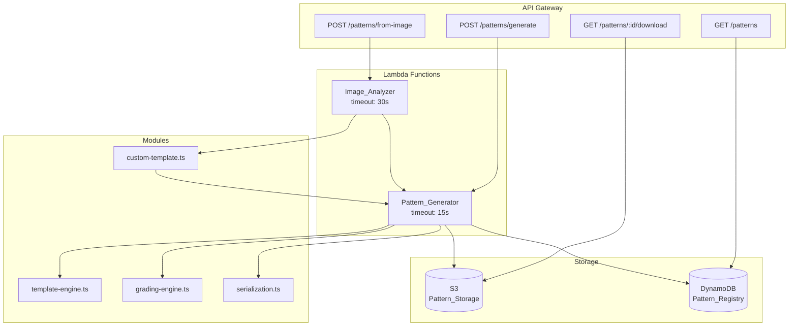

# Diseño Técnico — Generación de Patrones de Ropa

## Overview

El sistema de generación de patrones produce archivos SVG técnicos de confección para prendas deportivas de CronusFit. Opera en dos modos:

1. **Generación por parámetros**: El usuario selecciona tipo de prenda y talla; el sistema aplica plantillas paramétricas y la tabla de tallas configurada para producir un SVG con todas las piezas del patrón.
2. **Generación desde imagen**: El usuario sube una foto de prenda; el sistema extrae la silueta mediante procesamiento de imagen, infiere las piezas del patrón y genera el SVG escalado a la talla indicada.

Ambos modos producen un SVG 1.1 válido con marcas técnicas (margen de costura, piquetes, línea de hilo) y lo persisten en S3 con metadatos en DynamoDB.

### Decisiones de Diseño Clave

| Decisión | Justificación |
|----------|--------------|
| SVG.js + svgdom para generación server-side | SVG.js es la librería del stack; svgdom provee un DOM virtual para Node.js/Lambda sin navegador |
| Sharp para análisis de imagen | Ya existe como Lambda Layer; soporta extracción de canal alpha, threshold y contornos |
| Medidas internas en milímetros | Convención del proyecto (tech.md); se convierten a cm en el SVG de salida |
| Plantillas paramétricas por tipo de prenda | Permite escalado proporcional basado en la tabla de tallas sin rediseñar geometría |
| Validación round-trip SVG | Garantiza integridad: parse → serialize → parse produce resultado equivalente |

## Architecture



### Flujo de Generación por Parámetros

1. API Gateway recibe `POST /patterns/generate` con `{ garmentType, size }`
2. Lambda `Pattern_Generator` valida entrada contra tipos y tallas disponibles
3. `template-engine.ts` carga la plantilla paramétrica del tipo de prenda
4. `grading-engine.ts` aplica las medidas de la tabla de tallas a los puntos de control
5. `serialization.ts` genera el documento SVG con SVG.js/svgdom
6. El SVG se valida (parse round-trip, mínimo una pieza)
7. Se almacena en S3 y se registran metadatos en DynamoDB
8. Se retorna el ID del patrón y URL de descarga presignada

### Flujo de Generación desde Imagen

1. API Gateway recibe `POST /patterns/from-image` con imagen (multipart) y talla opcional
2. Lambda `Image_Analyzer` valida formato (PNG/JPEG) y tamaño (≤ 5MB)
3. Sharp procesa la imagen: resize → grayscale → threshold → extract alpha/contour
4. `custom-template.ts` convierte el contorno en piezas de patrón inferidas
5. Se invoca la lógica de `Pattern_Generator` con las piezas inferidas y la talla (M por defecto)
6. El flujo continúa igual que generación por parámetros desde el paso 5

## Components and Interfaces

### Lambda Handlers

#### `src/lambdas/pattern-generate/handler.ts`

```typescript
interface PatternGenerateRequest {
  garmentType: GarmentType;
  size: Size;
}

interface PatternGenerateResponse {
  patternId: string;
  downloadUrl: string;
  metadata: PatternMetadata;
}
```

#### `src/lambdas/pattern-from-image/handler.ts`

```typescript
interface PatternFromImageRequest {
  image: Buffer;          // PNG or JPEG, max 5MB
  mimeType: 'image/png' | 'image/jpeg';
  size?: Size;            // Default: 'M'
}

interface PatternFromImageResponse {
  patternId: string;
  downloadUrl: string;
  metadata: PatternMetadata;
  inferredPieces: string[];  // IDs of pieces inferred from image
}
```

### Business Logic Modules

#### `src/modules/pattern/template-engine.ts`

Responsable de cargar y aplicar plantillas paramétricas.

```typescript
interface ParametricTemplate {
  garmentType: GarmentType;
  pieces: PieceTemplate[];
}

interface PieceTemplate {
  id: string;                    // e.g. "panel-frontal", "manga-izquierda"
  controlPoints: ControlPoint[]; // Puntos paramétricos que escalan con medidas
  seamAllowanceMm: number;       // Margen de costura (default 10mm = 1cm)
  grainLineAngle: number;        // Ángulo de la línea de hilo (grados)
  notchPositions: number[];      // Posiciones relativas de piquetes (0-1)
}

interface ControlPoint {
  x: number;             // mm, posición base
  y: number;             // mm, posición base
  measurementRef: MeasurementKey;  // Medida corporal que afecta este punto
  scaleFactor: number;             // Factor de escala relativo a la medida
}

// Funciones exportadas
function loadTemplate(garmentType: GarmentType): ParametricTemplate;
function applyMeasurements(template: ParametricTemplate, measurements: SizeMeasurements): ScaledPattern;
```

#### `src/modules/pattern/grading-engine.ts`

Escala los puntos de control según la tabla de tallas.

```typescript
interface SizeMeasurements {
  chest: number;        // mm
  waist: number;        // mm
  hip: number;          // mm
  torsoLength: number;  // mm
  legLength: number;    // mm
  shoulderWidth: number; // mm
}

interface ScaledPattern {
  garmentType: GarmentType;
  size: Size;
  pieces: ScaledPiece[];
}

interface ScaledPiece {
  id: string;
  outline: PathData;          // Contorno de corte
  seamAllowance: PathData;   // Margen de costura a 1cm
  grainLine: LineData;        // Línea de hilo
  notches: LineData[];        // Piquetes
  label: string;              // Nombre de pieza + talla
}

function scalePiece(piece: PieceTemplate, measurements: SizeMeasurements): ScaledPiece;
function scalePattern(template: ParametricTemplate, measurements: SizeMeasurements): ScaledPattern;
```

#### `src/modules/pattern/serialization.ts`

Genera y valida el SVG final.

```typescript
interface SvgGenerationResult {
  svg: string;           // SVG document string
  isValid: boolean;
  pieceCount: number;
}

function generateSvg(pattern: ScaledPattern): SvgGenerationResult;
function parseSvg(svgString: string): ParsedSvgDocument;
function serializeSvg(doc: ParsedSvgDocument): string;
function validateRoundTrip(svgString: string): boolean;
```

#### `src/modules/pattern/custom-template.ts`

Convierte contornos extraídos de imagen en piezas de patrón.

```typescript
interface ExtractedContour {
  points: Array<{ x: number; y: number }>;
  boundingBox: { width: number; height: number };
}

interface InferredPieces {
  pieces: PieceTemplate[];
  confidence: number;       // 0-1, confianza en la inferencia
}

function contourToPieces(contour: ExtractedContour): InferredPieces;
function scaleToSize(pieces: PieceTemplate[], targetSize: Size, measurements: SizeMeasurements): ScaledPiece[];
```

### Validation Module

#### `src/validation/measurements.ts` (extensión)

```typescript
function validateGarmentType(type: string): type is GarmentType;
function validateSize(size: string): size is Size;
function validateSizeMeasurements(measurements: Partial<SizeMeasurements>): ValidationResult;
function validateImageInput(buffer: Buffer, mimeType: string): ValidationResult;
```

### Types

#### `src/types/garment.ts`

```typescript
type GarmentType = 'camiseta' | 'shorts' | 'leggings' | 'sudadera' | 'tank-top';
type Size = 'XS' | 'S' | 'M' | 'L' | 'XL' | 'XXL';
type MeasurementKey = 'chest' | 'waist' | 'hip' | 'torsoLength' | 'legLength' | 'shoulderWidth';
```

#### `src/types/pattern.ts`

```typescript
interface PatternMetadata {
  id: string;                          // UUID
  garmentType: GarmentType;
  size: Size;
  createdAt: string;                   // ISO 8601 UTC
  generationMethod: 'parameters' | 'image';
  s3Key: string;
  pieceCount: number;
}

type PathData = string;   // SVG path d attribute
interface LineData {
  x1: number; y1: number;
  x2: number; y2: number;
}
```

## Data Models

### DynamoDB Single-Table Design

Tabla: `CronusFit`

#### Pattern Entity

| Attribute | Value | Description |
|-----------|-------|-------------|
| PK | `PATTERN#{id}` | Partition key |
| SK | `METADATA` | Sort key |
| GSI1PK | `PATTERNS` | Para listado global |
| GSI1SK | `{createdAt}` | Orden descendente por fecha |
| garmentType | `camiseta` \| `shorts` \| ... | Tipo de prenda |
| size | `XS` \| `S` \| ... | Talla |
| createdAt | ISO 8601 | Fecha de creación |
| generationMethod | `parameters` \| `image` | Método utilizado |
| s3Key | `patterns/{id}/pattern.svg` | Clave en S3 |
| pieceCount | number | Número de piezas |

#### Size Table Entity

| Attribute | Value | Description |
|-----------|-------|-------------|
| PK | `SIZETABLE` | Partition key |
| SK | `SIZE#{size}` | Sort key (e.g. `SIZE#M`) |
| chest | number (mm) | Pecho |
| waist | number (mm) | Cintura |
| hip | number (mm) | Cadera |
| torsoLength | number (mm) | Largo de torso |
| legLength | number (mm) | Largo de pierna |
| shoulderWidth | number (mm) | Ancho de hombro |
| updatedAt | ISO 8601 | Última actualización |

### S3 Storage Layout

```
patterns/
  {patternId}/
    pattern.svg          # Archivo SVG del patrón
```

Acceso mediante presigned URLs con expiración de 1 hora.

### Access Patterns

| Operation | Key Condition | Index |
|-----------|--------------|-------|
| Get pattern by ID | PK = `PATTERN#{id}`, SK = `METADATA` | Table |
| List all patterns (by date) | GSI1PK = `PATTERNS`, GSI1SK desc | GSI1 |
| Get size measurements | PK = `SIZETABLE`, SK = `SIZE#{size}` | Table |
| Get all sizes | PK = `SIZETABLE`, SK begins_with `SIZE#` | Table |

